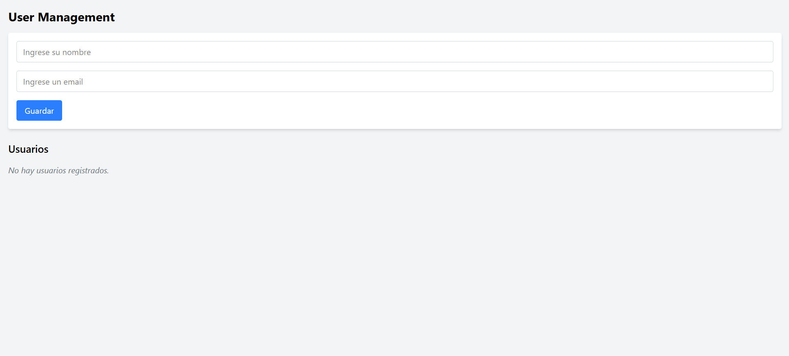

# Gestión de Usuarios - Prueba Técnica
La aplicacion esta diseñada para registrar usuarios y mostrarlos en un listado, ademas los usuarios se pueden eliminar del listado.

## Tecnologías Utilizadas
 - Frontend: React, Vite, Tailwind CSS, JavaScript
 - Backend: NestJS, TypeScript
 - Otros: Fetch API, npm

## Pasos para instalar y correr el proyecto
### 1. Descargar e instalar NodeJS (desde https://nodejs.org/es), en caso de no tenerlo
### 2. Clonar el repositorio
```sh
git clone https://github.com/Joaquin-Femenia/prueba-tecnica
```
### 3. Entrar a la carpeta backend e instalar dependencias
```sh
cd user-management
cd backend
npm install
```
### 4. Ejecutar el servidor
```sh
npm run start:dev
```
### 5. Abrir un nueva terminal en la raiz del proyecto, navegar a la carpeta backend e instalar dependencias
```sh
cd user-management
cd frontend
npm install
```
### 6. Ejecutar el servidor
```sh
npm run dev
```
### 7. Navega hasta el localhost del frontend: http://localhost:5173/

## Vista de la app web


## Comandos utiles para desarrollo
### Frontend
Ejecutar el proyecto en desarrollo con Vite
```sh
npm run dev
```
Generar la version optimizada para produccion
```sh
npm run dev
```
### Backend
Iniciar el servidor en modo desarrollo
```sh
npm run start:dev
```
Compilar el proyecto
```sh
npm run build
```